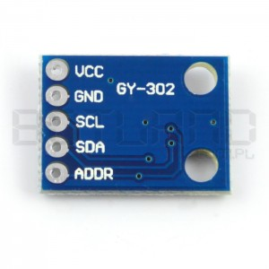

# BH1750 light meter

## General info

BH1750 light meter looks like this:



Library to handle it: [https://github.com/claws/BH1750](https://github.com/claws/BH1750)

## Connecting to Arduino

| BH1750 pin | Arduino pin | Details |
|------------|-------------|---------|
| VCC        | VCC         |         |
| GND        | GND         |         |
| SCL        | A5 (analog) | Serial clock (I2C) |
| SDA        | A4 (analog) | Serial data (I2C) |
| ADDR       | GND         | If ADDR is LOW, I2C address is 0x23. If it's HIGH, address will be 0x5C (TODO: verify that). This way it is possible to connect two light meters to one Arduino. |

### Note on I2C

BH1850 uses I2C addressing. According to [this article](http://www.gammon.com.au/i2c):

> The Two-Wire interface is extremely useful for connecting multiple devices,
> as they can all share the same two pins (plus a ground return). This is because
> the devices are "addressable". Each device needs to have a unique address
> in the range 8 to 119. Address 0 is reserved as a "broadcast" address,
> addresses 1 to 7 are reserved for other purposes, and addresses 120 to 127
> are reserved for future use.

On most Arduino boards, pin 4 (analog) maps to SDA (serial data), and pin 5 to SCL (serial clock).


## Code sample

This will print the light level every ~500 msec (actually it's longer than that,
because the measurement of light level itself takes time - according to the
documentation, around ~120 msec).

Light meter will be in the low power mode in betweeen measurements.

```c
#include <Wire.h>
#include "BH1750.h"

BH1750 light_meter;

uint16_t read_light_level() {
  // In this mode, light meter will automatically
  // move to power down mode after measurement.
  // No need to do this manually.
  // For other possible modes, see BH1750.h.
  light_meter.configure(BH1750_ONE_TIME_LOW_RES_MODE);
  return light_meter.readLightLevel();
}

void setup() {
  Serial.begin(9600);

  // Initially, light meter will be in power down mode.
  // We will power it up before each measurement in order
  // to save power.
  light_meter.begin(BH1750_POWER_DOWN);
}

void loop() {
  Serial.print("Alive!\n");

  uint16_t light_level = read_light_level();
  Serial.print("Light level: ");
  Serial.print(light_level);
  Serial.print("\n");

  delay(500);
}

```
