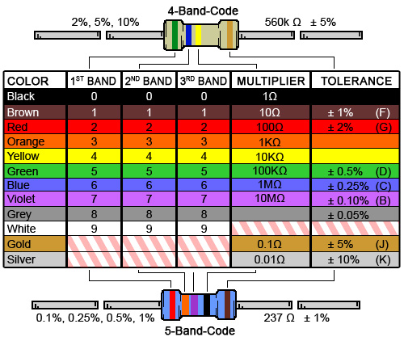

# Passive elements

- [5mm LED diode][]
- [BC337 NPN transistor][]
- [Resistor color codes][]

## 5mm LED diode

## BC337 NPN transistor

## Resistor color codes

### 4 band codes

It consists of four color stripes, 3 three next to each other on the left, and one to the right.

Meaning of those stripes:
  - first to the left: tens
  - second to the left: ones
  - third to the left: multiplier
  - fourth (the one to the right): tolerance

Each color has the following meaning (image from [this site](http://www.digikey.com/en/resources/conversion-calculators/conversion-calculator-resistor-color-code-4-band) that also has a handy calculator to get the resistance based on colors, if you don't feel like doing that manually ;)):

Note that this chart is for five band resistors. The logic is the same, though.

**Examples**

| 1st color | 2nd color | 3rd color | 4th color (right) | Meaning      |
|-----------|-----------|-----------|-------------------|--------------|
| Red       | Red       | Black     | Gold              | 22 Ohm +- 5% |
