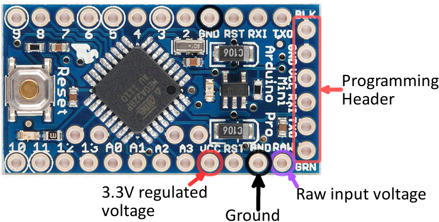

### Uploading to Arduino Pro Mini with USB-UART converter

#### Converter

My USB-UART converter, based on a FTDI FT232RL chip, has the following pins:

- PWR
- CTS
- RTS
- RxD
- TxD
- GND

In addition to those, it comes with a jumper used to select the power voltage - 3.3 or 5 V. **Remember to set this jumper correctly**.

#### Arduino

Arduino Pro Mini looks like this:

We're interested in the programming header (pins on the right).

- BLK - "black". Some USB-UART converters have "green" and "black" outer pins. If both Arduino and converter have those, you just need to match them, and all other pins should also match.
- GRN - "green". See above.
- GND - ground
- VCC - power
- RxI
- TxO

#### Drivers

Remember to install drivers for the USB-UART converter, i.e. from this website:
http://www.ftdichip.com/Drivers/VCP.htm

#### Connections

This is the configuration that works for me (both programming the Arduino, and serial monitor are working):

| Arduino | USB-UART converter | Description |
|---|---|---|
| BLK | GND | Ground |
| VCC | PWR | Power - either 3.3 or 5V, **depending on the converter jumper configuration** |
| RxI | TxD | |
| TxO | RxD | |
| GRN | RTS | |

#### Arduino IDE setup

Select proper board and processor (voltage and speed).

#### Troubleshooting

In case you get an "avrdude: stk500_recv(): programmer is not responding" error,
make sure your pins are connected correctly (i.e. they're not loose).

In case you cannot see the USB port on the list in "Ports" menu in Adruino IDE,
make sure you have the USB-UART drivers installed.