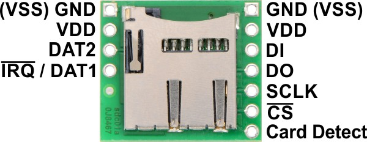

# Pololu micro-SD card reader

**WARNING: Before you start be aware that not every micro-SD card works well over
           SPI interface. I've had success with Samsung 8GB micro-SD class 10 card.**
           I've failed with SanDisk 2GB one and with Kingston 8GB class 10 card.

## Reader



## Pin connections

This reader uses SPI bus.

| Pololu SD reader | Arduino | Description |
|------------------|---------|-------------|
| DI               | 11      | SD reader data in (MOSI) |
| DO               | 12      | SD reader data out (MISO) |
| SCLK             | 13      | Clock |
| CS               | Any, 10 is the default one for SPI | Chip select |

### Note on SPI

Source: [https://www.arduino.cc/en/reference/SPI](https://www.arduino.cc/en/reference/SPI)

Master device is, usually, a microcontroller (i.e. Arduino).

- MISO - Master in, Slave out - used by slave device to send data to master device
- MOSI - Master out, Slave in - used by master device to send data to slave device
- SCK - Serial Clock - used to synchronize data transmission. Is generated by master.
- SS - Slave Select - the pin on each device that the master can use to enable and disable specific devices. If slave device reads LOW on this pin, it communicates with the master. If it's HIGH, it ignores all the communication.

Arduino Pins:

| Board | MOSI | MISO | SCK | SS |
|-------|------|------|-----|----|
| Pro Mini | 11   | 12   | 13  | configurable by the SD library, 10 is the default |


## Sample code

This is a slightly modified [DumpFile example](https://www.arduino.cc/en/Tutorial/DumpFile):

```c
/*
 The circuit:
 * SD card attached to SPI bus as follows:
 ** MOSI - pin 11
 ** MISO - pin 12
 ** CLK - pin 13
 ** CS - pin 10
 */

#include <SPI.h>
#include <SD.h>

const int chipSelect = 10;

void setup() {
  Serial.begin(9600);

  if (!SD.begin(chipSelect)) {
    Serial.println("Card failed, or not present");
    return;
  }

  File dataFile = SD.open("a.txt");

  if (dataFile) {
    while (dataFile.available()) {
      Serial.write(dataFile.read());
    }
    dataFile.close();
  } else {
    Serial.println("error opening datalog.txt");
  }
}

void loop() {
}
```

## Troubleshooting

### IMPORTANT note on SD cards

When using SD reader for the first time, I spent a lot of time trying to figure
out why the following code would fail:

```c
if (!SD.begin(10)) {
  // Fails, so flow control enters here.
}
```

I tried:

- to verify whether I've soldered the goldpins to the reader and Arduino correctly
- to use [Adafruit SD library](https://github.com/adafruit/SD) instead of standard one shipped with Arduino IDE
- reformat SD cards using Mac OS Disk Utility, `newfs_msdos` command and, finally, the [SD Formatter from SD Association](https://www.sdcard.org/downloads/formatter_4/).

All those steps failed every single time. And, [depending on the card used, errors would be different](http://arduino.stackexchange.com/questions/13360/read-from-the-sd-card-acmd41-times-out).

I've had issues with micro-SD cards from SanDisk, Kingston, and some whitelabel ones. Finlly, the **Samsung micro-SD class 10 8 GB card just worked**. No format needed.