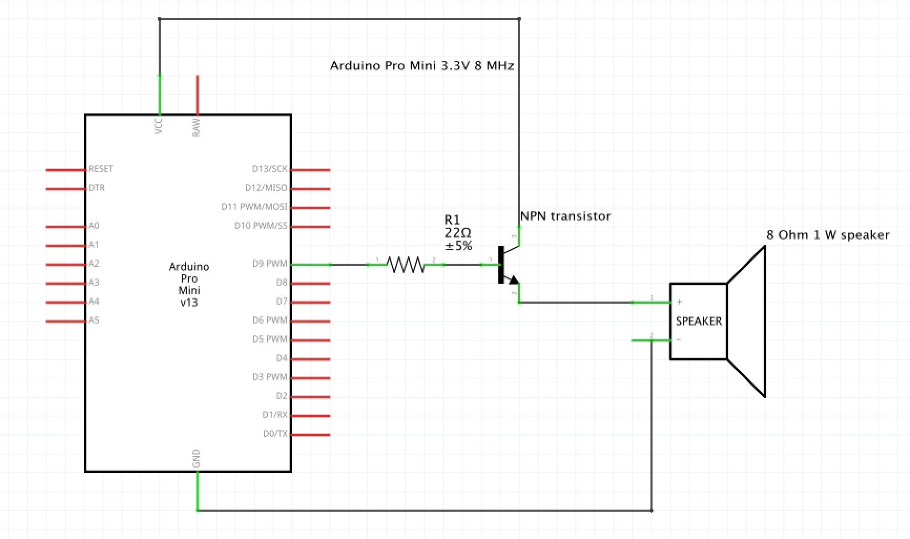

# Speaker

## Using one NPN transistor

The simplest way to connect speaker to Arduino is using a single NPN transistor:

  - collector - connect to Arduino's VCC.
  - emitter - connect to `+` of the speaker.
  - base - connect to one of Arduino PWM pins **through a resistor** (I used pin 9 on Arduino Pro Mini). This pin will be used to drive the transistor and thus, the speaker, to making sounds.
  - speaker `-` - connect to the ground

It could look like:

